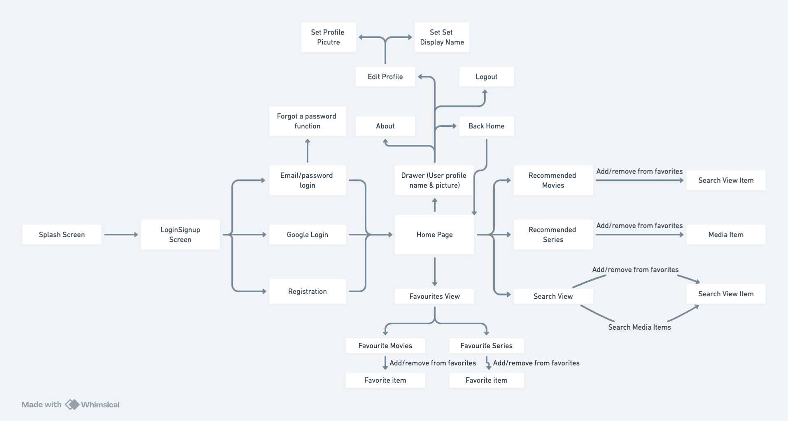

# MyGeekDB - Android App

## Description
MyGeekDB is a Firebase-powered Android application built with Jetpack Compose that allows users to manage their profile, 
authenticate using email or Google Sign-In, and includes features like profile picture management and account deletion.

#Project Walkthrough

[Video](https://youtu.be/EW1q2XsieC0)

# Project Components Breakdown

## Classic Android Elements
- Firebase Authentication
- Firebase Firestore Database
- Firebase Storage
- Activity Result Contracts (Image picker)
- ViewModels
- LiveData
- Coroutines

## Jetpack Compose UI Elements

### Layout Components
- Box
- Column
- Row
- Spacer
- Surface
- Scaffold
- ModalNavigationDrawer

### Material Design 3 Components
- TopAppBar
- IconButton
- Button
- OutlinedButton
- OutlinedTextField
- CircularProgressIndicator
- Text
- Icon
- HorizontalDivider

### Navigation & State
- NavController (Compose Navigation)
- rememberNavController
- rememberCoroutineScope
- rememberLauncherForActivityResult
- rememberDrawerState

### Modifiers
- Modifier.fillMaxSize()
- Modifier.padding()
- Modifier.size()
- Modifier.clip()
- Modifier.background()
- Modifier.clickable()
- Modifier.align()

### State Management
- remember
- mutableStateOf
- observeAsState
- LaunchedEffect
- derivedStateOf

### Image Handling
- Coil Image Loading (rememberAsyncImagePainter)
- AsyncImage
- Image composable

### Custom Composables
Referenced in:

### Screen Composables
- LoginSignupScreen
- HomePage
- EditProfileView
- AboutView
- FavoritesView

### Styling
- MaterialTheme
- Custom color gradients
- Typography styles
- Custom shapes (CircleShape)
- Custom colors and transparency

### Data Observation
- LiveData integration with Compose using observeAsState
- ViewModel state management
- Coroutine scope for async operations

## Features
- User Authentication (Email/Password & Google Sign-In)
- Profile Management
- Profile Picture Upload
- Account Deletion
- Navigation Drawer
- Material 3 Design

## Technologies Used
- Kotlin
- Jetpack Compose
- Firebase Authentication
- Firebase Firestore
- Firebase Storage
- Coil Image Loading Library
- Material 3 Components

## Project Setup
1. Clone the repository
2. Add your `google-services.json` file to the app directory
3. Create .env file with your TMBD API key (.env_example present in the project)
3. Enable Authentication methods in Firebase Console
4. Set up Firestore Database
5. Configure Firebase Database rules

   '''
   rules_version = '2';
   service cloud.firestore {
   match /databases/{database}/documents {
   match /users/{userId} {
   allow read, write: if request.auth != null && request.auth.uid == userId;

   match /favoriteMovies/{movieId} {
   allow read, write: if request.auth != null && request.auth.uid == userId;
   }

   match /favoriteSeries/{seriesId} {
   allow read, write: if request.auth != null && request.auth.uid == userId;
   }
   }
   }
   }

   '''
6. Configure Firestorage
7. Firestorage Rules 

'''

rules_version = '2';
service firebase.storage {
match /b/{bucket}/o {
match /profile_images/{userId}/{fileName} {
allow read: if request.auth != null;
allow write: if request.auth != null && request.auth.uid == userId;
}
}
}

'''
### App logical design

## Sources & References

### Official Documentation
- [Jetpack Compose](https://developer.android.com/jetpack/compose)
- [Firebase Android Setup](https://firebase.google.com/docs/android/setup)
- [Firebase Authentication](https://firebase.google.com/docs/auth)
- [Firebase Firestore](https://firebase.google.com/docs/firestore)
- [Firebase Storage](https://firebase.google.com/docs/storage)
- [Material Design](https://developer.android.com/develop/ui/compose/designsystems/material3)
- [Gradle plugins](https://plugins.gradle.org/search?term=hierynomus)
- [Google Play services Authentication](https://developers.google.com/android/guides/client-auth)
- [Splash Screens](https://developer.android.com/develop/ui/views/launch/splash-screen)

### APIs
- [TMBD](https://developer.themoviedb.org/v4/reference/account-movie-recommendations)
- [TMBD-Kotlin](https://github.com/ChrisKruegerDev/tmdb-kotlin?tab=readme-ov-file)
- [Postman](https://web.postman.co/)

### Libraries
- [Coil Image Loading](https://coil-kt.github.io/coil/)
- [Google Sign-In](https://developers.google.com/identity/sign-in/android)
- [Material 3 for Android](https://m3.material.io/develop/android)
- 

### Tutorials & Guides
- Android App development Module HDip SETU by Dave Drohan
- [Android Developers - Navigation](https://developer.android.com/guide/navigation)
- [Firebase Authentication Guide](https://firebase.google.com/docs/auth/android/start)
- [Compose Navigation](https://developer.android.com/jetpack/compose/navigation)
- [Compose Crash Course](https://www.youtube.com/watch?v=6_wK_Ud8--0)
- [News App](https://www.youtube.com/watch?v=RIK0CmCps14)
- [Todo App](https://www.youtube.com/watch?v=P3xQdINdrWY&list=PLgpnJydBcnPA5aNrlDxxKWSqAma7m3OIl&index=10)

### GitHub Repositories
- [Firebase-UI-Android](https://github.com/firebase/FirebaseUI-Android)
- [Accompanist](https://github.com/google/accompanist)
- [Compose Samples](https://github.com/android/compose-samples/tree/main/Reply)
- [Firebase quick start](https://github.com/firebase/quickstart-android)

### Inspirations
- [My previous project](https://geek-db-matleszs-projects.vercel.app/about)
- [Project Management App](https://github.com/matlesz/projemanag/tree/master/app/src/test/java/com/projemanag)
- [Sample Kotlin app](https://www.youtube.com/watch?v=XLt_moCoauw)
- [Online Shop App](https://www.youtube.com/watch?v=jh1GXnFw7rM)
- [Now in android](https://github.com/android/nowinandroid)

### Code Samples
- [Android Compose Samples](https://github.com/android/compose-samples)
- [Firebase Android Samples](https://github.com/firebase/quickstart-android)

## License
This project is licensed under the MIT License - see the LICENSE file for details.

## Contributing
1. Fork the repository
2. Create your feature branch
3. Commit your changes
4. Push to the branch
5. Create a new Pull Request
